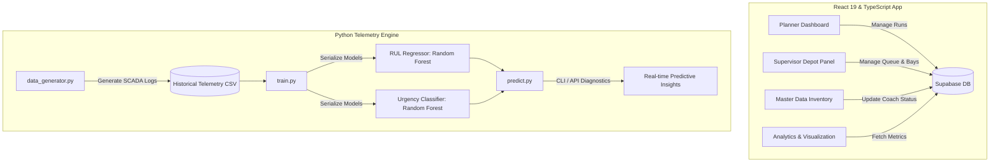

# 🚇 KMRL Smart Induction Controller & Predictive Maintenance Platform

[](https://react.dev/)
[](https://www.typescriptlang.org/)
[](https://vite.dev/)
[](https://tailwindcss.com/)
[](https://supabase.com/)
[](https://www.python.org/)

A professional, state-of-the-art multi-page web application and machine learning pipeline developed for **Kochi Metro Rail Limited (KMRL)**. The system serves as a real-time operational dashboard for rolling stock induction planning, depot operations management at Muttom Depot, and predictive maintenance analysis of trainset coaches using SCADA and IoT sensor telemetry.

---

## 🌟 Key Capabilities & Features

### 1. 📋 Role-Based Access Control
- **Planner Portal**: High-level scheduling, induction evaluation, fitness scores, route assignments (e.g., *Aluva - SN Junction*, *Aluva - Petta*), and stabling operations.
- **Supervisor Portal**: Deep real-time visibility into **Muttom Depot** maintenance bays, wash/cleaning bays, and active servicing queues.

### 2. 🎛️ Modular Operational Dashboards
- **Planner Dashboard**: Drag-and-drop or select-to-schedule trainsets, evaluate health statuses, check fitness, and generate strategic readiness grades before mainline deployment.
- **Supervisor Dashboard (Depot Overview)**: Manage real-time cleaning and maintenance queues. Monitor interactive bays (Occupied, Available, In Maintenance) and track physical rolling stock allocations.
- **Master Data Management**: Live inventory panel showing mileage, wear statuses, and service histories for each coach type (Driving/Trailer).

### 3. 📊 Analytics & Telemetry Visualization
- Beautiful interactive **Recharts** representing telemetry correlations (e.g., brake wear vs. vibration), rolling stock health distributions, and historical trends.
- Comprehensive exports and custom reports in the **Reporting & Analytics** suite.

### 4. 🧠 SCADA/IoT Machine Learning Engine
- A Python predictive pipeline that evaluates mechanical SCADA parameters to forecast **Remaining Useful Life (RUL)** in kilometers and classify the **Maintenance Urgency Status** of the coaches.
- Core telemetry metrics evaluated:
  - **Brake Pad Thickness** (degrades from `15.0 mm` to `1.5 mm`)
  - **Pantograph Force** (fatigue and contact loss detection)
  - **Cabin Vibrations** (suspension degradation indicator)
  - **Guide Shoe Temperature** (lubrication breakdown indicator)
  - **Door Open Cycles** (actuator wear tracking)

---

## 🏗️ System Architecture



---

## 🛠️ Technology Stack

- **Core Frontend**: React 19, TypeScript, Vite
- **Styling & Animations**: Tailwind CSS v4, Motion (Framer Motion)
- **Data Visualizations**: Recharts, Lucide Icons
- **Backend & Database**: Supabase (PostgreSQL with real-time relational client connection)
- **Predictive Engine**: Python, Scikit-Learn, Pandas, Joblib

---

## 🚀 Execution & Setup Guide

### 💻 Frontend Web Application

#### 1. Clone & Install Dependencies
Navigate to the root directory and install node modules:
```bash
npm install
```

#### 2. Environment Configuration
Create a `.env` file in the root directory (you can copy the structure from `.env.example`):
```bash
cp .env.example .env
```
Update `.env` with your active Supabase URL and Public Anon Key:
```env
VITE_SUPABASE_URL=https://your-supabase-project.supabase.co
VITE_SUPABASE_ANON_KEY=your-actual-supabase-anon-key
```

#### 3. Database Initialization
Ensure your Supabase project tables are set up. Execute the SQL scripts in the Supabase SQL editor:
1. Run [supabase_schema.sql](supabase_schema.sql) to initialize base tables, foreign keys, and seed mock data.
2. Run [supabase_schema_update.sql](supabase_schema_update.sql) if there are schema enhancements or telemetry tracking requirements.

#### 4. Run Development Server
```bash
npm run dev
```
Open [http://localhost:5173](http://localhost:5173) in your browser.

---

### 🐍 Python ML Telemetry Engine

The ML engine resides in the `ml_engine/` directory.

#### 1. Setup Virtual Environment & Dependencies
```bash
cd ml_engine
python -m venv venv
source venv/bin/activate  # On Windows: venv\Scripts\activate
pip install -r requirements.txt
```

#### 2. Generate Historical SCADA Dataset
Simulate 1,500 wear logs for rolling stock sensors:
```bash
python data_generator.py
```
*Outputs: `data/kmrl_telemetry_historical.csv`*

#### 3. Model Training & Validation
Train the regression model (RUL) and classification model (Urgency Status):
```bash
python train.py
```
*Outputs:*
- `models/rul_regressor_model.pkl` (Remaining Useful Life Predictor)
- `models/urgency_classifier_model.pkl` (Urgency Category: `OPTIMAL`, `DUE SOON`, `IMMINENT`)

#### 4. Real-time Diagnostics
Run a diagnostic test directly in the console using the serialized models:
```bash
python predict.py
```

---

## 🗄️ Supabase Relational Database Schema

The relational schema represents rolling stock assets and maintenance tracking at Muttom Depot:
- **`coaches`**: ID, Type (Driving/Trailer), Health (%), Mileage (KM), Maintenance Status, Status (Active, Standby, etc.), History logs (JSONB).
- **`fleet_units`**: ID, Status, Mileage, Health, Associated Coach IDs (JSONB), Route, Start Time, Maintenance Flags.
- **`schedule_items`**: Time, Route, Status, Control Status. Linked to `fleet_units`.
- **`maintenance_slots`**: Active servicing queues for Cleaning and Maintenance at Muttom Depot.
- **`bays`**: Cleaning and Maintenance physical bays tracking availability, functionality, and current occupied task.

---

## 📦 Project Directory Structure

```
├── .env.example             # Example environment template
├── .gitignore               # Excludes secrets, dist, node_modules
├── README.md                # Project documentation
├── index.html               # Main HTML entry
├── index.tsx                # Main React entry point
├── package.json             # NPM dependencies and scripts
├── src/
│   ├── components/
│   │   └── Layout.tsx       # Standard modern sidebar & topbar layout
│   ├── context/
│   │   └── AppContext.tsx   # React Context for global state & Supabase data sync
│   ├── data/
│   │   └── mockData.ts      # Backup mock datasets
│   ├── pages/
│   │   ├── Login.tsx        # Secure role selection portal
│   │   ├── PlannerDashboard.tsx   # Train induction planner
│   │   ├── SupervisorDashboard.tsx # Muttom Depot supervisor view
│   │   ├── DataVisualization.tsx   # Telemetry charts
│   │   ├── ReportingAnalytics.tsx # Performance exports & logs
│   │   └── MasterData.tsx   # Coach inventories & wear metrics
│   ├── services/
│   │   ├── api.ts           # Induction readiness logic engine
│   │   └── supabase.ts      # Supabase Client connection
│   ├── types.ts             # TypeScript definitions
│   └── utils.ts             # Utilities & helper methods
├── ml_engine/               # Machine Learning predictive maintenance module
│   ├── data/                # SCADA Telemetry dataset
│   ├── models/              # Serialized Random Forest models (.pkl)
│   ├── data_generator.py    # SCADA telemetry simulator
│   ├── train.py             # Random Forest fitting & evaluation script
│   ├── predict.py           # CLI diagnostics & predictions wrapper
│   └── requirements.txt     # Scikit-learn, Pandas, etc.
├── supabase_schema.sql      # Main database setup script
└── supabase_schema_update.sql # DB schema updates & functions
```

---

*KMRL Smart Induction Controller — Keeping Kochi Connected Safely through AI & Automation.*
