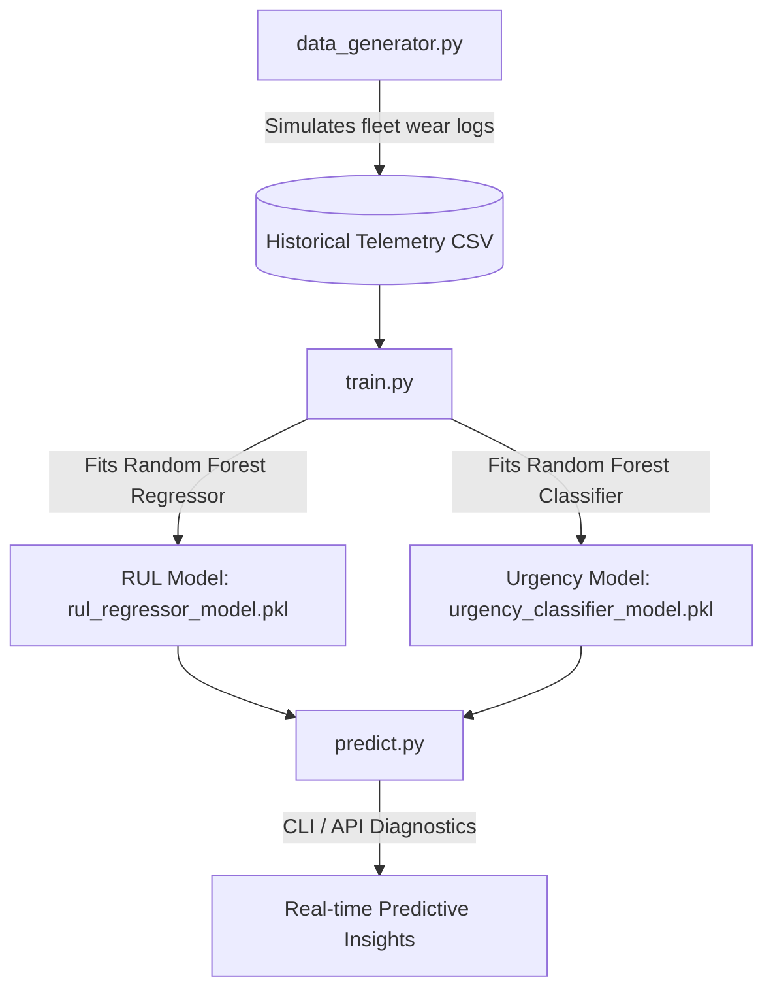

# Kochi Metro (KMRL) ML Telemetry Engine: Predictive Maintenance

This module provides a production-ready Machine Learning predictive maintenance pipeline designed for the **Kochi Metro Smart Induction Controller**. It analyzes SCADA and IoT sensor telemetry (vibrations, temperatures, forces, door cycles, brake wear) to forecast the **Remaining Useful Life (RUL)** in kilometers and classify the **Maintenance Urgency Status** of the rolling stock coaches.

---

## 🛠️ System Architecture

The pipeline consists of three core components:



---

## 📋 Input Telemetry Features

The machine learning models are trained on five critical mechanical SCADA metrics:

| IoT Sensor Field | Nominal Range | Wear Behavior | Impact |
| :--- | :--- | :--- | :--- |
| **Brake Pad Thickness** (`brake_pad_thickness_mm`) | `15.0 mm` | Wears down to `1.5 mm` | Frictional braking degradation |
| **Pantograph Force** (`pantograph_force_n`) | `120.0 N` | Fluctuates / drops | Electrical contact loss & fatigue |
| **Cabin Vibrations** (`cabin_vibrations_g`) | `0.04 g` | Rises to `0.22 g` | Suspension joint fatigue |
| **Guide Shoe Temp** (`guide_shoe_temp_c`) | `42.0 °C` | Spikes to `78.0 °C` | Lubrication degradation |
| **Door Open Cycles** (`door_cycles`) | `0` | Increases cumulatively | Actuator gear wear |

---

## 🚀 Execution & Usage Guide

### 1. Installation
Install the necessary packages listed in `requirements.txt`:
```bash
pip install -r requirements.txt
```

### 2. Generate Historical SCADA Data
Run the simulator to construct a dataset of `1,500` telemetry log histories:
```bash
python data_generator.py
```
*Outputs: `data/kmrl_telemetry_historical.csv`*

### 3. Model Training & Evaluation
Train the predictive regression and classification models:
```bash
python train.py
```
This script evaluates feature importance, computes accuracy metrics, and serializes the models:
*Outputs:*
* `models/rul_regressor_model.pkl` (Predicts Remaining Useful Life in KM)
* `models/urgency_classifier_model.pkl` (Classifies urgency: `OPTIMAL`, `DUE SOON`, `IMMINENT`)

### 4. Real-time Telemetry Diagnostics
Load the models and run a fast command-line diagnostics test:
```bash
python predict.py
```

### 5. Python API Integration Example
To integrate predictions directly into a web backend or scheduler:
```python
from predict import predict_maintenance_need

# Telemetry from active coach on Aluva-Thrippunithura corridor
diagnostics = predict_maintenance_need(
    brake_mm=3.8,
    panto_force=108.5,
    vibrations=0.155,
    temp_c=71.2,
    doors=6100
)

print(f"Remaining Useful Life : {diagnostics['remaining_useful_life_km']} KM")
print(f"Operational Urgency   : {diagnostics['maintenance_urgency']}")
print(f"Action Recommendation : {diagnostics['action_required']}")
```
